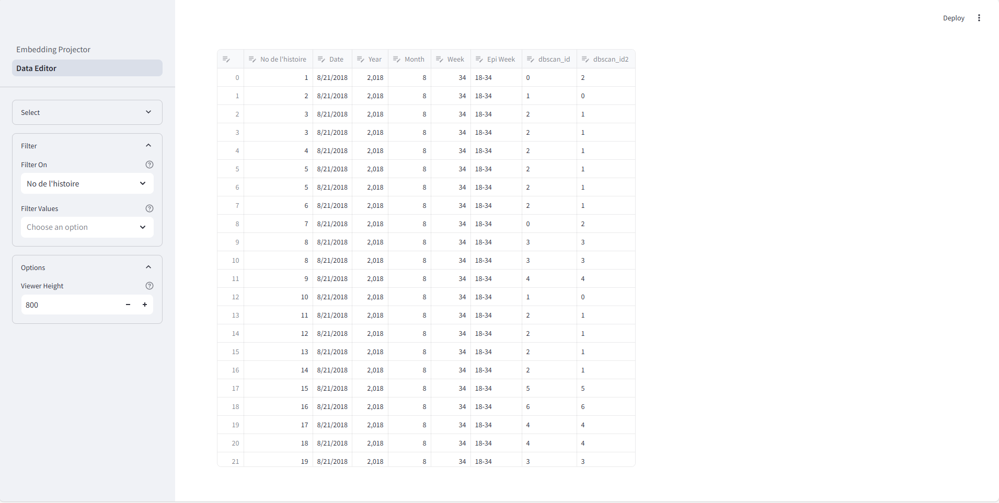

# Text Analysis and Representation System (TARS)
TARS is a web app, written in [Streamlit](https://streamlit.io/), for generating and analyzing text embeddings. Broadly, the app recreates the analytic flow of embeddings-based topic-modeling algorithms like [BERTopic](https://maartengr.github.io/BERTopic/index.html), allowing users to generate embeddings, reduce their dimensionality, and cluster them in the dimensionally-reduced space. Like BERTopic, the app can generate lists of potential topics using a cluster-based variant of [TF-IDF](https://en.wikipedia.org/wiki/Tf–idf), but, by way of LLM-based iterative summarization, it can also generate free-text summaries of the information in the clusters. The app makes these summaries, as well as any data artifacts generated during a session, available for download and further analysis offline.

## User Interface
The app has two pages: an embedding projector for working with the embeddings, and a data editor for editing the underlying session metadata and clustering results. Both pages point to the same set of underlying data objects, so changes to the data in one should propagate to the other, and vice-versa.

### Embebedding Projector
The projector interface is divided into two main components: a viewing pane for rendering the embeddings in 3- or 2-d space, and a sidebar for working with the embeddings. The sidebar is divided into three subsections: `I/O`, for loading and downloading session data; `Analysis`, for generating, shrinking, clustering, and summarizing the embeddings; and `Options`, for changing the current data projection view and managing advanced session settings.

Some of the expander menus are available at the beginning of a session, while others will only appear after certain artifacts have been generated, like by uploading a dataset or by running a clustering algorithm. If something doesn't appear when or where you think it should, though, please open an [issue](https://github.com/scotthlee/nlp-tool/issues/) so we can take a look.

### Data Editor
The editor is also divided into two components: a viewing pane that displays the current session data (i.e., whatever is plotted on the projector page), and a sidebar with a few simple tools for filtering and reshaping the same. 

Currently, the app does not have a version control system in place for the session data, so any changes here will permanently overwrite the previous version. We hope to add support for reverting changes in the near future, but for now, user beware!

## Getting Started
### Data Loading
Users can start a work session with two kinds of input data: a CSV file holding the text to be embedded in a single column (Option 1); or a CSV file holding a set of premade embeddings (Option 2a), in which case they can also upload a CSV file holding line-level metadata corresponding to the embeddings (Option 2b). For files that don't contain premade embeddings, users will be prompted to choose a column holding the text they would either like to embed (Option 1) or to use for generating cluster keywords and free-text summaries (2b) for premade embeddings after running a clustering algorithm. In all cases, the input files should have headers, so that the first row comprises column names and not data to be analyzed.

### Embedding Generation
The app currently only supports a single embedding model: OpenAI's `text-embedding-ada-002`, which it accesses over the Azure OpenAI API. Support for more models, including those offered by HuggingFace over their API, as well as those that are small enough to run locally without GPU compute, will be added in the future.

### Dimensionality Reduction
The app implements three algorithms for reducing the size of the raw text embeddings: principal component analysis ([PCA](https://en.wikipedia.org/wiki/Principal_component_analysis)), uniform manfiold approximation and projection ([UMAP](https://umap-learn.readthedocs.io/en/latest/)), and t-distributed stochastic neighbor embedding ([t-SNE](https://en.wikipedia.org/wiki/T-distributed_stochastic_neighbor_embedding)). Of these three, UMAP probably has the most flexible and robust out-of-the-box performance, and so it will run automatically with its default hyperparameters as soon as embeddings are created or loaded. The dimensionally-reduced versions of the embeddings will be used for the two later analytic steps (clustering and summarization), and users can switch between these versions during a session using the `Switch Projection` dialog under the `Options` expander menu. All reductions are saved by default.

### Cluster Analysis
The app supports four clustering algorithms: [k-means](https://en.wikipedia.org/wiki/K-means_clustering), [DBSCAN](https://en.wikipedia.org/wiki/DBSCAN), [HDBSCAN](https://hdbscan.readthedocs.io/en/latest/how_hdbscan_works.html), and [agglomerative clustering](https://en.wikipedia.org/wiki/Hierarchical_clustering), all implemented with `scikit-learn`. After selecting an algorithm from the dropdown menu, users can modify the values for the algorithm's main hyperparameters (e.g., the number of cluster for k-means, or epsilon for DBSCAN), and they can supply arguments for modifying other hyperparameters as a dict of keyword arg to be unpacked at runtime.

### Summarization and Interpretation
Users can get summaries of the information in each of the embedding clusters in two ways: by checking the list of cluster-based keywords, generated automatically when a clustering algorithm is run, and available immediately for download thereafter; and by generating a free-text summary report using the features in the `Summarize` expander menu. For the latter, users can tailor the summary report to their particular needs by providing a high-level description of the data they uploaded to embed, and by providing a list of questions they would like answered about the text in each cluster. With those in place, the final steps are to choose a fitted cluster model to use for groupng the embeddings and to specify how many documents should be randommly sampled from each cluster for ChatGPT to use as the basis for writing its summary. The final summary report is generated iteratively, with the cluster-specific summaries being run first, and the top-level report being generated at the end.

### Downloading Artifacts
At any point during a work session, users can download whatever data artifacts have been generated. Download buttons will appear in the `I/O` expander menu for the raw embeddings, reduced-dimensionality embeddings, cluster keywords, and LLM-generated cluster summary report as they are created by the app. Cluster IDs are attached to rows in the files holding the reduced embeddings and cluster keywords, and cluster sizes and variances are provided in the summary report, along with the corresponding cluster IDs. 

## Deployment Options
### Local Machine
To run the app locally, you'll need to be using a CDC-issued computer that's connected to the CDC network, either directly by being on campus, or indirectly over ZScaler. If that's you, then you can follow these steps to get up and running:

1. Clone or download this repo.
2. Install the required dependencies (these are listed in requirements.txt).
3. Open a command prompt (Windows) or terminal (Linux).
4. Navigate to the repo folder.
5. Launch the app by entering `streamlit run Embeddings.py` in the command prompt or terminal.

### Posit Connect
There are a number of ways to [deploy Streamlit apps](https://docs.posit.co/connect/user/streamlit/) on Posit Connect. The command-line deployment is an easy option, which you can do by following these steps:

1. Clone or download this repo.
2. Install the required dependencies (these are listed in requirements.txt).
3. Navigate to the folder holding the repo (so, one level up from where the repo files are stored).
4. Open a command prompt or terminal and paste in the following command:

<pre>rsconnect deploy streamlit \
--server https://rconnect.edav.cdc.gov/ \
--api-key YOUR_API_KEY \
--entrypoint Embeddings.py \
--environment GPT4_URL \
--environment API_TYPE \
--environment API_VERSION \
--environment SP_TENANT_ID \
--environment SP_CLIENT_ID \
--environment SP_CLIENT_SECRET \
nlp-tool/</pre>

If you'd rather add your environment variables to the app after deployment, you can delete those lines, and if you run into errors with authentication during deployment, you can try adding the `--insecure` flag to the command, although that may not adhere to security best practices. In all cases, you will need an API key for your Posit Connect account, and your account will probably need Publisher access to the platform. If you haven't set those up yet, contact EDAV for more help.

### Notes
This version of the app requires an Azure Service Principal with access to the Azure OpenAI API. Environment variables should match how they are used in the code, for example, so that `GPT4_URL` is the base URL for the relevant Azure OpenAI model deployments (the app uses `gpt-4-turbo` and `text-embedding-ada-002`), `API_TYPE` is 'azure_ad', `SP_TENANT_ID` is your Service Principal tenant ID, and so on. Please reach out to either your program informatics lead or EDAV technical support for help setting those up, if you run into issues.

## License Standard Notice
The repository utilizes code licensed under the terms of the Apache Software
License and therefore is licensed under ASL v2 or later.

This source code in this repository is free: you can redistribute it and/or modify it under
the terms of the Apache Software License version 2, or (at your option) any
later version.

This source code in this repository is distributed in the hope that it will be useful, but WITHOUT ANY
WARRANTY; without even the implied warranty of MERCHANTABILITY or FITNESS FOR A
PARTICULAR PURPOSE. See the Apache Software License for more details.

You should have received a copy of the Apache Software License along with this
program. If not, see http://www.apache.org/licenses/LICENSE-2.0.html

The source code forked from other open source projects will inherit its license.
